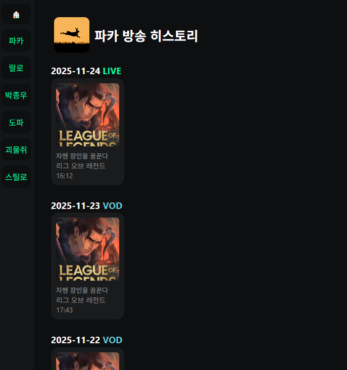
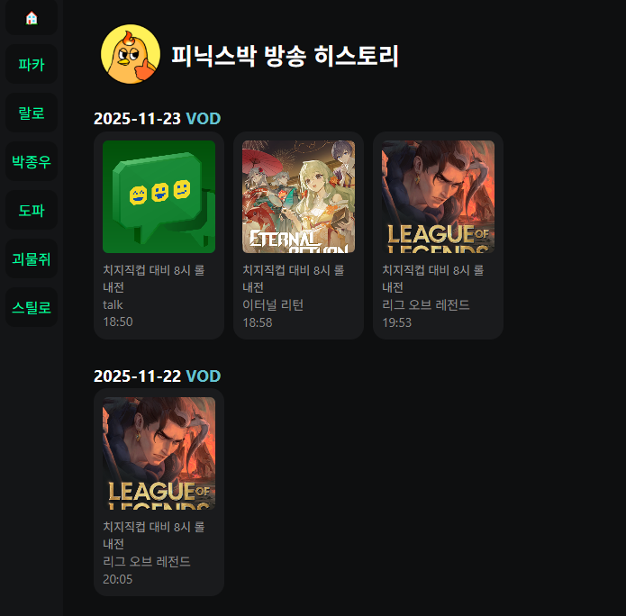

# 치지직의 방송 변경 내역을 기록하는 서비스

[](https://iftype.github.io/chzzk-client/)

프로젝트 링크: [https://iftype.github.io/chzzk-client/](https://iftype.github.io/chzzk-client/)

| 라이브 중                | 다시보기 연결          |
| ------------------------ | ---------------------- |
|  |  |

---

## 프로젝트 소개

방송인들의 카테고리나 타이틀 변경 기록을 저장하고, 생성된 다시보기를 해당 생방송의 기록과 연결해줍니다.

## 🛠Tech Stack

  


## 신경 쓴 부분

### Component

```js
// Comopnent.js
export default class Component {
  constructor($target, props = {}) {
    this.$target = $target;
    this.props = props;

    this.$wrapper = document.createElement("div");
    this.$wrapper.classList.add(this.constructor.name);
    this.$target.appendChild(this.$wrapper);

    this.state = this.initState();
    this.setup();
    this.render();
    this.componentDidMount();
  }
  initState() {
    return {};
  }
  setup() {}
  setState(newState) {
    this.state = { ...this.state, ...newState };
    this.render();
    this.componentDidUpdate();
  }
  template() {
    return "";
  }
  render() {
    this.$wrapper.innerHTML = this.template();
  }
  componentDidMount() {}
  componentDidUpdate() {}
}
```

컴포넌트 클래스는 개발자 황준일님의 [Vanilla Javascript로 웹 컴포넌트 만들기](https://junilhwang.github.io/TIL/Javascript/Design/Vanilla-JS-Component/)를 참고했습니다.

컴포넌트의 생명 주기를 이해하기위해 사용했는데 여기서 가장 크게 얻은 부분은 `constructor`에선 `await`을 기다리지 않는다 입니다.  
하지만 비동기적으로 데이터를 받아와서 업데이트를 해야했기에 다음과 같은 방법을 사용했습니다.

컴포넌트 내부에서 `$wrapper`을 만들어 `constructor.name`으로 만들어 불필요한 `div`를 줄여봤습니다.

```js
// StreamerView.js
async setup() {
const { id } = this.props;
const channel = Store.getChannel(id);

this.setState({channel: channel,});
const liveLogList = await fetchStreamerLogData(id);
this.setState({
  liveLogList: liveLogList,
  isLoading: false,
});

```

setup에서 비동기 함수를 호출하되, `await`을 받아올 때, `setState` 값을 변경하여 `rerendering` 시켜줬습니다.

### Router

#### HashRouter

```js
// Router.js
navigate(path) {
  const hashPath = path.startsWith("#") ? path : "#" + path;
  window.location.hash = hashPath;
}
```

라우터는 Hash기반의 라우터를 사용했습니다.  
SPA를 구현하려면 어느 링크에 들어가도 `index.html`을 반환했어야 됐는데, 이 과정은 서버에서 진행됩니다.  
하지만 정적 페이지인 `Github Pages`에서는 그 과정이 불가능했기 때문에 `404 page`에서 처리하는 등 본래의 의도와 맞지 않는 방법으로 해결해야 됐습니다.  
저는 클라이언트도 `Github Pages`가 아닌 다른 페이지에 배포하려고 생각 중이여서 해쉬라우터로 개발을 진행하였습니다.

#### Event Bubbling

```js
// ChannelCard.js
this.$wrapper.addEventListener("click", () => {
  this.$wrapper.dispatchEvent(
    new CustomEvent("navigateCard", {
      detail: this.props.channelId,
      bubbles: true,
    })
  );
});
```

```js
// App.js
this.$target.addEventListener("navigateCard", (e) => {
    // 해결
}
```

이벤트 버블링을 사용하여 `Channel Card`의 `click`이벤트를 App에서 처리할 수 있었습니다.

### Global Store

```js
export default new GlobalStore();
```

프리코스 3주차에 사용했던 모듈 싱글톤을 활용하여 전역상태관리 객체를 만들었습니다
